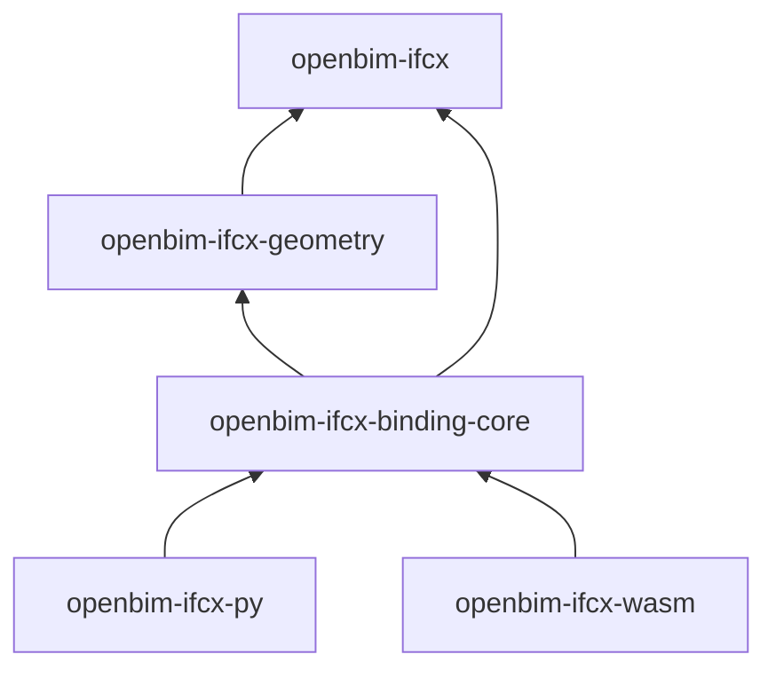

<!-- Generated by `cargo run -p xtask -- docs` from the crate manifests and changelogs. Do not edit: change the source and regenerate. -->

# Crate reference

Each crate is versioned and released on its own. Every page here is generated from the crate itself: its manifest, its `README.md`, its public API and its `CHANGELOG.md`. The full Rust API is in the [rustdoc](/api/).

| Crate | Latest release | Distributed as | Description |
| --- | --- | --- | --- |
| [`openbim-ifcx`](./crates/openbim-ifcx) | 0.1.0 (2026-10-03) | [crates.io `openbim-ifcx`](https://crates.io/crates/openbim-ifcx) | Lossless reader and writer for IFC5 / IFCX files, the layered JSON model. |
| [`openbim-ifcx-geometry`](./crates/openbim-ifcx-geometry) | 0.1.0 (2026-10-03) | [crates.io `openbim-ifcx-geometry`](https://crates.io/crates/openbim-ifcx-geometry) | Renderer-neutral geometry and viewer helpers for IFC5 / IFCX: transforms, meshes, curves, point clouds, presentation, a flat render scene, and GLB export. |
| [`openbim-ifcx-binding-core`](./crates/openbim-ifcx-binding-core) | not released | not published on its own (`publish = false`); ships inside the bindings | Host-independent core shared by the openbim-ifcx language bindings (WebAssembly, Python). |
| [`openbim-ifcx-py`](./crates/openbim-ifcx-py) | 0.1.1 (2026-10-03) | [PyPI `openbim-ifcx`](https://pypi.org/project/openbim-ifcx/) | Python bindings for openbim-ifcx: read, write, validate, compose and export IFC5 / IFCX files from Python. |
| [`openbim-ifcx-wasm`](./crates/openbim-ifcx-wasm) | 0.2.0 (2026-10-03) | [npm `@openbim/ifcx`](https://www.npmjs.com/package/@openbim/ifcx) | WebAssembly bindings for openbim-ifcx: read, write, validate, compose and export IFC5 / IFCX files from JavaScript. |

## How the crates depend on each other

The bindings reach IFCX only through the binding core; nothing depends on a binding, and `openbim-ifcx` depends on no other crate here ([ADR 0002](/adr/0002-crate-split-by-dependency-weight)).

